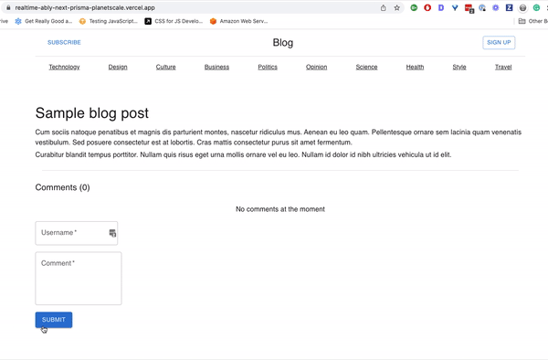

This is a [Next.js](https://nextjs.org/) project bootstrapped with [`create-next-app`](https://github.com/vercel/next.js/tree/canary/packages/create-next-app). This project illustrates a sample blog with a comment section. This comment section uses real-time communication to display the latest comments submitted by users. Then, Prisma and PlanetScale are used for data persistence.

The project is hosted on Vercel and can be viewed live: [Live version](https://realtime-ably-next-prisma-planetscale.vercel.app/)

## Technologies used
 - Next.js: React framework to create a client and implement API routes
 - Ably: Platform to implement publish/subscribe messaging
 - Prisma: JavaScript ORM to write queries
 - PlanetScale: a database-as-a-service offering free SQL databases

## Starting the project

First, run the development server:

```bash
npm run dev
# or
yarn dev
```

Open [http://localhost:3000](http://localhost:3000) with your browser to see this result:
